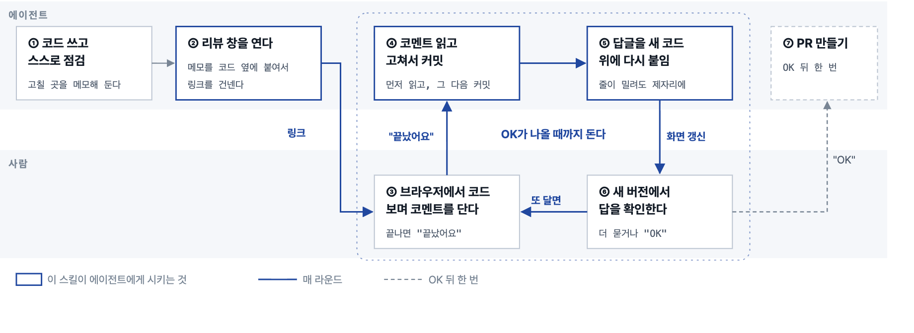
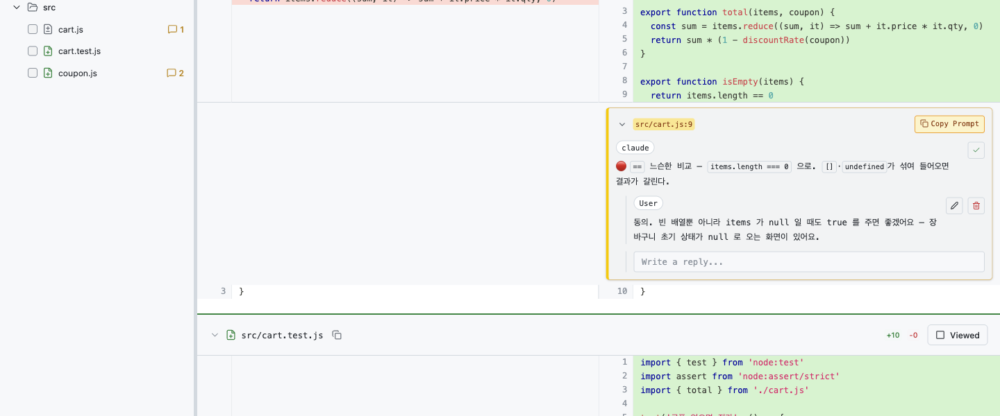
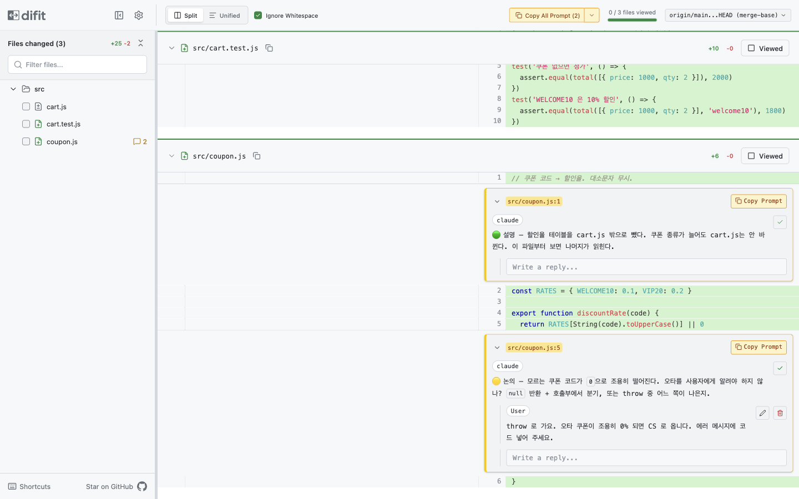
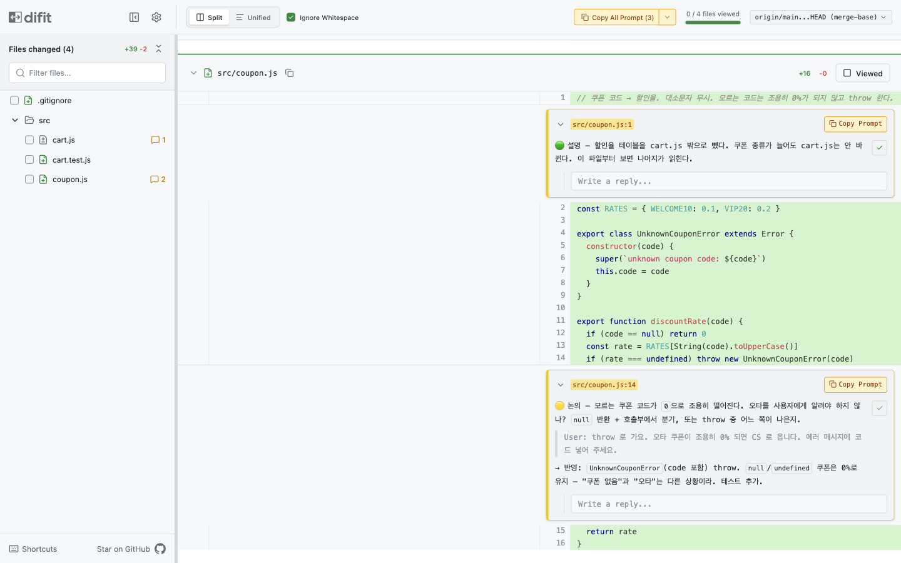
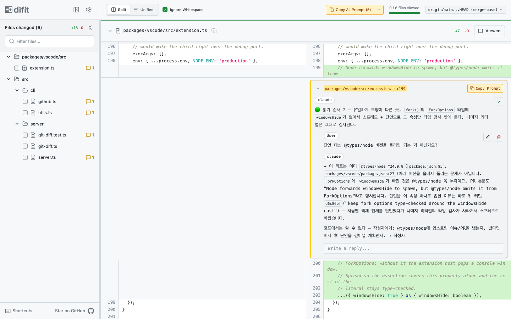

# difit-loop

코딩 에이전트가 **PR을 올리기 전에 사람 리뷰를 받고, 반영하고, OK가 나올 때까지 반복**하게 하는 스킬 — 그리고
반대 방향으로 **남의 PR을 읽으며 묻는** `difit-ask`.
리뷰 화면은 [difit](https://github.com/yoshiko-pg/difit)(로컬 diff 뷰어)이고, difit은 고치지 않는다 — 어떻게 부르고,
무엇을 넣고, 커밋 사이에서 코멘트를 어떻게 살리는지만 정한다.

```bash
npx skills add socar-chel/difit-loop -g
```

설정은 없다. 설치 후 Claude Code에서 `/difit-loop <base>` 또는 "PR 준비하자"로 호출한다.
Node ≥ 21이면 difit은 `npx`로 알아서 받는다.

## 한 라운드



점선 상자가 한 라운드다 — ③→④→⑤→⑥이 돌고, OK가 나올 때까지 반복한다. 사람이 하는 일은 ③과 ⑥뿐이다 —
**브라우저에서 코드를 보며 코멘트를 달고 "끝났어요"**, 반영을 보고 **더 묻거나 "OK"**. 나머지는 에이전트가 한다.
파란 테두리가 이 스킬이 에이전트에게 시키는 부분이다.

## 실제 화면

장난감 리포(`feat/coupon`, 파일 3개)에서 한 라운드를 돌린 기록이다.

**① 에이전트가 띄운 리뷰 창** — 셀프리뷰 스레드가 코드 옆에 미리 달려 있고(🔴), 사용자가 답글을 단다.
우상단 `origin/main...HEAD (merge-base)` — 원격 main이 2커밋 전진해 있어도 diff에 섞이지 않는다.



**② 같은 라운드의 🟡·🟢** — 논의 스레드에는 사용자가 결정을 남기고(throw로), 설명 스레드는 읽고 지나간다.



**③ 반영 커밋 뒤** — 에이전트가 커밋 전에 수집한 스레드를 새 diff의 맞는 줄로 옮겨 다시 올렸다.
원문 → 사용자 답글(`>` 인용) → `→ 반영:` 답변이 한 스레드에 이어지고, 코드는 이미 바뀌어 있다.
화면이 갱신되면 사용자는 여기서 "OK" 또는 다음 코멘트를 이어 간다.



## 왜 그냥 difit을 띄우면 안 되나

| 그냥 띄우면 | 이 스킬은 |
| --- | --- |
| 커밋을 하나 쌓는 순간 코멘트 스레드가 **빈 세션**이 된다 — 세션 키가 base+target 커밋 쌍이라 | 커밋 **전에** 수집하고, `carry-comments.mjs`로 새 diff의 맞는 줄에 다시 올린다 |
| 원격 base가 전진해 있으면 남의 머지분이 diff에 섞인다 | `--merge-base`로 고정하고 기동 직후 `/api/diff`와 git을 대조한다 |
| 브라우저 창을 닫으면 서버와 메모리의 코멘트가 함께 죽는다 | `--keep-alive` — 탭을 닫아도 서버는 산다 |
| 포트가 조용히 +1로 밀려 옛 탭을 보게 된다 | 레포 이름에서 포트를 계산하고(`difit-port.sh`), 실제 포트를 JSON에서 읽는다 |
| 에이전트가 단 스레드가 엉뚱한 줄에 붙거나 안 보인다 | `first-added-line.mjs`로 `+` 줄만 앵커로 쓴다 |

## 반대 방향 — `difit-ask`

같은 설치로 들어오는 두 번째 스킬. **남이 올린 PR·브랜치**를 워크트리로 받아 difit에 띄우고, 사용자가 코드 줄에
단 질문에 에이전트가 주변 코드·호출부·테스트를 읽고 **같은 스레드에 답글**을 단다. 코드는 고치지 않는다.

| | `difit-loop` | `difit-ask` |
| --- | --- | --- |
| 방향 | 내 코드를 사람이 리뷰 | 남의 코드를 사람이 읽고 에이전트에게 질문 |
| 라운드의 산출물 | 반영 커밋 | 스레드 답변 |
| 세션 | 커밋마다 리셋 → 이월 | 커밋이 없어 유지 → `reply` 그대로 |
| 먼저 하는 일 | 🔴🟡🟢 지적 스레드 | 🟢 읽기 순서 투어 (파일 5개 이상일 때 제안) |
| 끝 | "OK" → PR 생성 | "다 읽었다" → 작성자에게 물을 것을 초안 파일로 (게시는 사용자) |

`/difit-ask 123` 또는 "이 PR 같이 봐줘"로 시작한다. 절차는 [skills/difit-ask/SKILL.md](skills/difit-ask/SKILL.md).



실제 공개 PR(yoshiko-pg/difit #470, 파일 6개)에서 — 🟢 투어 → 사용자 질문 → `package.json:95`·커밋 `d6c86bf`를 근거로 답하고,
코드만으로 모르는 것은 `→ 작성자`로 표시해 마무리 초안으로 모은다.

## 코멘트 규약

스레드 본문은 신호등으로 시작한다. 리뷰어는 빨강부터 본다.

| | 뜻 |
| --- | --- |
| 🔴 | 반드시 수정 — 버그·보안·데이터 손실처럼 머지되면 안 되는 것 |
| 🟡 | 논의·제안 — 판단이 갈리거나 더 나은 대안이 있어 보이는 것 |
| 🟢 | 설명 — 조치 불필요. 왜 이렇게 했는지, 무엇을 먼저 볼지 |

파일 첫 줄에 총평을 달지 않는다(그 줄에 대한 지적으로 읽힌다). 커밋 뒤 답변은 `reply`가 아니라 **새 thread**로
온다 — 원문이 `>` 인용으로 붙는다.

## 들어 있는 것

```
skills/
├── difit-loop/
│   ├── SKILL.md                  절차 0~7단계 · 코멘트 주입 규약 · 스택 PR 모드
│   └── scripts/                  의존성 없음 (difit-ask 도 이것을 쓴다)
│       ├── first-added-line.mjs  diff에서 파일별 첫 + 줄 → 코멘트 앵커
│       ├── carry-comments.mjs    커밋으로 끊긴 스레드를 새 diff로 이월
│       ├── pending-threads.mjs   마지막 메시지가 사용자 것인 스레드만 — 답할 질문 목록
│       ├── difit-port.sh         origin 레포명 → 5100~5890 사이 10의 배수 포트
│       └── difit-health-check.sh 창이 이상할 때 프로세스 · 포트별 /api/diff
└── difit-ask/
    └── SKILL.md                  남의 PR 읽기 루프 (워크트리 → 투어 → 질문/답글)
```

```bash
node --test skills/difit-loop/scripts/*.test.mjs
```

## 선택 사항

- **PR 전 강제** — CLAUDE.md에 `- PR을 만들기 전에 /difit-loop 로 사용자 리뷰를 받는다.`
- **포트 직접 지정** — CLAUDE.md에 `- 레포별 포트: <레포A> 5100 · <레포B> 5110`. 계산값보다 우선한다.
- **다른 에이전트** — 절차는 셸 명령과 규칙뿐이라 AGENTS.md 등에 SKILL.md 내용을 옮기면 된다.

실측 기준 difit v5.0.12. upstream `difit`·`difit-review` 스킬(`npx skills add yoshiko-pg/difit`)은 단발 실행을
다루고, 이 스킬은 그 위의 루프다.

## 라이선스

MIT
